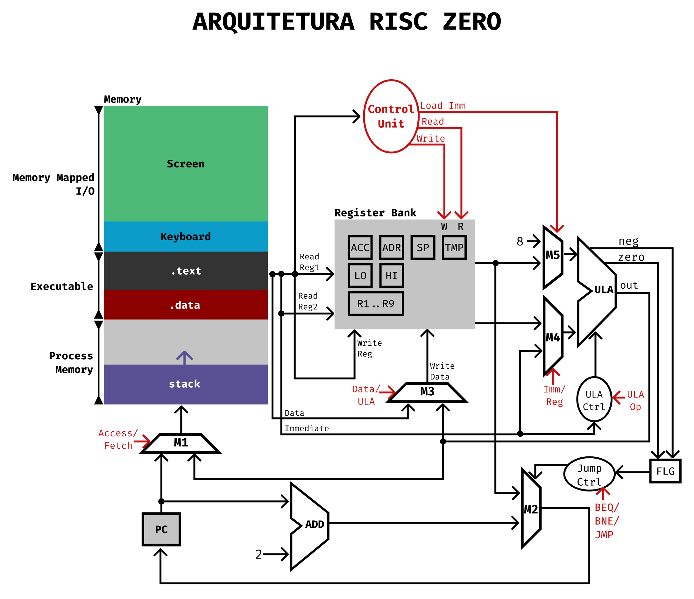

# Risc Zero

## Esboço da arquitetura

### Visão geral

- Endereçamento de 16 bits
- 8 registradores no total (16 bits)
- Big Endian

### Registradores

- 16 registradores expostos
    - TMP (Usado pelo montador)
    - HI (High)
    - LO (Low)
    - SP (Stack pointer)
    - ADR (Address)
    - ACC (Acumulador)
    - FL (Flags)
    - R1..R9
- Registradores ocultos: *program counter.*

## Instruções

### Instruções aritméticas:

- [R] `ADD <reg1> <reg2>` - `reg1 += reg2`
- [R] `MULT <reg1> <reg2>` - `reg1 *= reg2`
- [R] `DIV <reg1> <reg2>` - `HI = reg1 / reg2, LO = reg1 % reg2`
- [R] `MOV <reg1> <reg2>` - `reg1 := reg2`

### Instruções bit-a-bit:

- [R] `AND <reg1> <reg2>` - `reg1 &= reg2`
- [R] `OR <reg1> <reg2>` - `reg1 |= reg2`
- [R] `NOT <reg1>` - `reg1 = ~reg1`
- [R] `SHL <reg1> <reg2>` - `reg1 <<= reg2`
- [R] `SHR <reg1> <reg2>` - `reg1 >>= reg2`

### Instruções de desvio:

- [J] `BEQ <reg1>` - `if (!ZERO) goto reg1`
- [J] `BNE <reg1>` - `if (ZERO) goto reg1`
- [J] `JMP <reg1>` - `goto reg1`

### Instruções de comparação:

- [R] `CEQ <reg1> <reg2>` - `ZERO := !(reg1 == reg2)`
- [R] `CLT <reg1> <reg2>` - `ZERO := !(reg1 < reg2)`

### Instruções de acesso à memória:

- [M] `LDB <reg1> <im> <reg2>` - `reg1 := *(reg2 + im)`
- [M] `STB <reg1> <im> <reg2>` - `*(reg2 + im) := reg1`
- [M] `LDW <reg1> <im> <reg2>` - `reg1 := *(int16_t *)(reg2 + im)`
- [M] `STW <reg1> <im> <reg2>` - `*(int16_t *)(reg2 + im) := reg1`

### Instruções imediatas
- [I] `ANDI <reg1> <im>` - `reg1 &= im`
- [I] `ADDI <reg1> <im>` - `reg1 += im`
- [I] `LUI <reg1> <im>` - `reg1 = im << 8`
- [I] `LLI <reg1> <im>` - `reg1 = im & 0xff`

### Input/Output

A entrada/saída de dados através dos dispositivos de entrada/saída
é feita a partir da instrução `INT` (Interrupt), que atua como uma
chamada do sistema operacinal (_syscall_) a partir do que estiver no
registrador de acumulação.

- ACC == 1: READ_CHAR,
- ACC == 2: READ_INTEGER,
- ACC == 3: PRINT_CHAR
- ACC == 4: PRINT_DECIMAL
- ACC == 5: PRINT_BINARY
- ACC == 6: PRINT_HEX,

O resultado lido/imprimido na tela é sempre relativo ao registrador
R1.

## Layout das instruções:

Tipo | OpCode | Reg1 | Reg2 | Im | Opts
-----|--------|------|------|----|-----
R    | 4      | 4    | 4    | -  | 4
I    | 4      | 4    | -    | 8  | -
M    | 4      | 4    | 4    | 4  | -
J    | 4      | 4    | -    | -  | 8

## Ciclo da instrução
- Na borda de subida do clock, ocorre a leitura da instrução e sua decodificação.
- Na borda de descida, ocorre o write back.

## Diagrama

