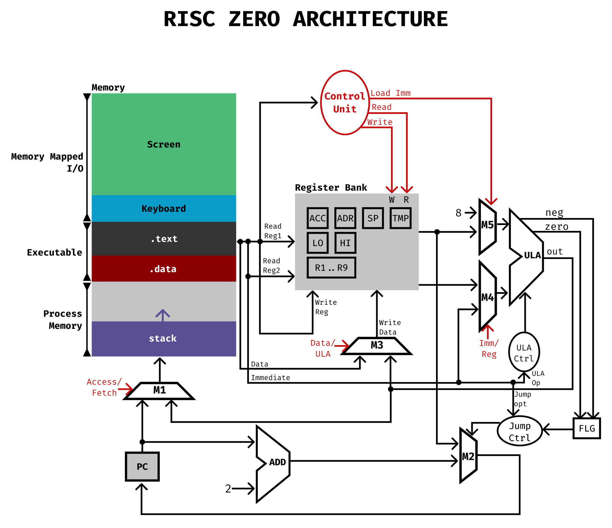

# Risc Zero

## Introdução

RISC Zero é uma arquitetura monociclo de uso geral com 16 registradores, construida para a disciplina de **Prática em Organização de Computadores (SSC0119)** da Universidade de São Paulo. Junto de seu esquemático do circuito, foram construídos um _assembler_ e um simulador capazes de transformarem um código em Zassembly (Assembly da arquitetura RISC Zero) em um binário executável através do simulador.

  

    Esquemático do circuito
  

    

## Visão geral e características da arquitetura

- Barramentos de endereço de 16 bits.
- 16 registradores no total, sem contar o _program counter_ (PC).
- Memória estruturada na forma _Big Endian_.
- Mapeamento dos dispositivos de entrada e saída diretamente na memória principal.

### Banco de registradores

- 16 registradores expostos:
    - `TMP` (Usado pelo montador)
    - `HI` (High)
    - `LO` (Low)
    - `SP` (Stack Pointer)
    - `ADR` (Address)
    - `ACC` (Acumulador)
    - `FLG` (Flags)
    - `R1..R9` (Registradores de uso geral)

- Registradores ocultos: 
    - `PC` (Program Counter)

## Layout das instruções:
RISC Zero possui 4 diferentes layouts de instruções, uma vez que cada uma empenha um papel diferente ao ser chamada:

- **Instrução tipo-R:** Caracteriza-se por ser uma instrução de acesso à simultâneos registradores. Normalmente efetuando operações aritméticas e bit-a-bit.

- **Instrução tipo-I:** Caracteriza-se por ser uma instrução que interage com um valor imediato. É utilizada também em operações aritméticas e para operações que suportam _offsets_.

- **Instrução tipo-M:** Caracteriza-se por ser uma instrução de acesso à memória. Ou seja, é um tipo de instrução que se relaciona diretamente com registradores que representam endereços na memória princial (como o stack pointer).

- **Instrução tipo-J:** Caracteriza-se por ser uma instrução de branching, ou de desvio, interrompendo o atual fluxo do programa e redirecionando-o para outro endereço.

Na tabela abaixo, podemos ver o mapeamento dos bits em cada modelo de instrução:

Tipo / Bytes | OpCode | Reg1 | Reg2 | Im | Opts
-------------|--------|------|------|----|-----
R            | 4      | 4    | 4    | -  | 4
I            | 4      | 4    | -    | 8  | -
M            | 4      | 4    | 4    | 4  | -
J            | 4      | 4    | -    | -  | 8

## Ciclo da instrução
- Na borda de subida do clock, ocorre a leitura da instrução e sua decodificação.
- Na borda de descida, ocorre o write back.

## Instruções suportadas
Contendo uma gama de instruções, a arquitetura RISC Zero possui uma linguagem montadora plenamente funcional, possuindo suporte para definição de valores estáticos, macros, rótulos e funções. Além disso, pseudoinstruções muito úteis também podem ser encontradas em ``assembler/examples/stdio.zasm``.

### Instruções aritméticas:

- [R] `ADD <reg1> <reg2>` - `reg1 += reg2`
- [R] `SUB <reg1> <reg2>`  - `reg1 -= reg2`
- [R] `MULT <reg1> <reg2>` - `reg1 *= reg2`
- [R] `DIV <reg1> <reg2>` - `HI = reg1 / reg2, LO = reg1 % reg2`
- [R] `MOV <reg1> <reg2>` - `reg1 := reg2`

### Instruções bit-a-bit:

- [R] `AND <reg1> <reg2>` - `reg1 &= reg2`
- [R] `OR <reg1> <reg2>` - `reg1 |= reg2`
- [R] `NOT <reg1>` - `reg1 = ~reg1`
- [R] `SHL <reg1> <reg2>` - `reg1 <<= reg2`
- [R] `SHR <reg1> <reg2>` - `reg1 >>= reg2`

### Instruções de desvio:

- [J] `BEQ <reg1>` - `if (ZERO) goto reg1`
- [J] `BNE <reg1>` - `if (!ZERO) goto reg1`
- [J] `BLT <reg1>` - `if (NEG) goto reg1`
- [J] `BLE <reg1>` - `if (ZERO or NEG) goto reg1` 
- [J] `BGT <reg1>` - `if (!NEG) goto reg1`
- [J] `BGE <reg1>` - `if (ZERO or !NEG) goto reg1`
- [J] `JMP <reg1>` - `goto reg1`

### Instruções de comparação:

- [R] `CMP <reg1> <reg2>` - `ZERO := (reg1 == reg2), NEG := (reg1 < reg2)`

### Instruções de acesso à memória:

- [M] `LDB <reg1> <im> <reg2>` - `reg1 := *(reg2 + im)`
- [M] `STB <reg1> <im> <reg2>` - `*(reg2 + im) := reg1`
- [M] `LDW <reg1> <im> <reg2>` - `reg1 := *(int16_t *)(reg2 + im)`
- [M] `STW <reg1> <im> <reg2>` - `*(int16_t *)(reg2 + im) := reg1`

### Instruções imediatas
- [I] `ANDI <reg1> <im>` - `reg1 &= im`
- [I] `ADDI <reg1> <im>` - `reg1 += im`
- [I] `LUI <reg1> <im>` - `reg1 = im << 8`

### Input/Output

A entrada/saída de dados através dos dispositivos de entrada/saída
é feita a partir da instrução `INT` (Interrupt), que atua como uma
chamada do sistema operacinal (_syscall_) a partir do que estiver no
registrador de acumulação.

- `ACC == 1`: READ_CHAR,
- `ACC == 2`: READ_INTEGER,
- `ACC == 3`: PRINT_CHAR
- `ACC == 4`: PRINT_DECIMAL
- `ACC == 5`: PRINT_BINARY
- `ACC == 6`: PRINT_HEX,

O resultado lido/imprimido na tela é sempre relativo ao registrador
R1.

